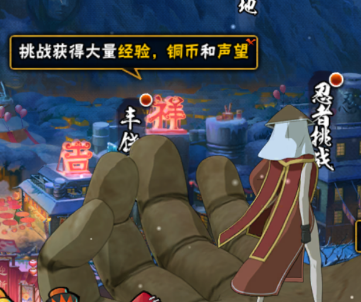

# 常见问题

[项目相关](#项目相关)

[使用相关](#使用相关)

**[敲黑板](#敲黑板)**

## 项目相关

1. Q: 目前能用了吗？

    A: 还算能用（？），目前正在广泛招募开发者和测试员中。

2. Q: 可以在手机上用吗？

    A: 不可以，你至少需要一台有独立显卡的电脑（因为要做图像识别）。

## 使用相关

1. Q: 推荐什么模拟器

    A: 开发组都是用mumu的，其他模拟器没测试过。

2. Q: 分享界面卡住怎么办？

    A: 在模拟器设置里将锁定旋转设为横屏

## 敲黑板

1. MaaNM不喜欢站街特效的查克拉

    已经完全看不见字了！

    
